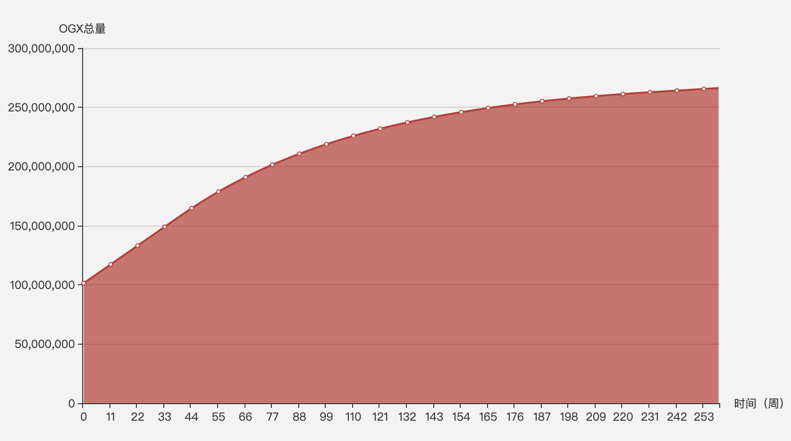

[Whitepaper in English ](https://github.com/OrganixProtocol/whitepaper/blob/master/README-En.md)

# Organix Whitepaper
#### 版本 1.1 (2020 11月20日) 

## 1. 背景

DeFi 即去中心化金融，是目前区块链落地应用中最符合区块链特征（去中心，开放，匿名，可信任，价值传递等）的场景之一。

2015年以太坊将智能合约带入区块链，经过多年的用户积累和开发者社区的不断贡献，大量项目方将代币发行在以太坊网络之上，这是DeFi可以在以太坊上发展起来的主要原因。但受限于以太坊的性能瓶颈，高昂的矿工费用以及较慢的确认时间，使得DeFi目前仍无法大范围内普及和应用[1]，目前主流的DeFi项目也只有1,000左右的日活。[2]

EOS是第三代区块链系统，可以实现大规模的商业应用，几乎零成本的交易并实现秒级的链上确认。目前基于EOS上的开发的游戏、DEX等都已经取得了成功，用户体验得以大幅提升。

但在DeFi领域 EOS上的项目仍然是不活跃的状态，主要原因之一是相对于已运行多年的以太坊来说EOS主网上的资产种类以及流动性相对匮乏，而DeFi的本质上主要是资产之间的抵押、置换、流通等。

所以，如何解决EOS上资产的流动性和多样性，是DeFi能否在EOS上取得成功的重点。 Organix的出现是为了解决EOS目前存在的这一问题，同时EOSIO的高性能也是Organix最终能够得到很好体验的基础。

## 2. Organix 简介

Organix 是基于EOS的去中心化合成资产发行、交易协议。

合成资产是一种用于模拟基础资产(金融衍生品等)的金融工具。通常需要超额的抵押物进行合成资产的铸造，合成资产的价格通过预言机来同步外部真实资产的价格。

MakerDAO 是ETH上一个合成资产协议，系统中抵押铸造的DAI 就是一种合成资产。他的价格锚定的是美元，由超额抵押的ETH等多个抵押物作为价值背书，同时通过一定的抵押率和清算率以保证DAI价格的稳定。

OGX是Organix网络协议中的基础通证，可以通过超额抵押OGX生成oUSD，oUSD为系统内的稳定币，抵押铸造的价格为1USD，初始抵押率为800%，以保证oUSD在即使OGX有很大的价格波动下也可以有足够的价值支撑。通过oUSD可以在Organix系统中的合成资产交易所根据不同资产的预言机价格交易不同类型的合成资产，包括但不限于加密货币，大宗商品，法定货币，某个品类的一篮子货币以及它们对应的反向资产等。

由于铸造合成资产不需要真实的资产存在，也不需要交易对手，只需要有足够的价值支撑即可无限制的生成，同时只要有稳定的预言机价格提供，就可以铸造各种类型的资产，不需要考虑资产跨链，资产上链等问题。 解决了目前DEX中流动性不足和代币种类单一的问题。 

## 3. 主要功能

### 3.1 抵押OGX铸造/销毁oUSD

项目初期所有的oUSD都是由超额抵押的OGX铸造产生，初始的最低抵押率为800%。用户可以铸造的oUSD数量取决于持有和锁定的OGX数量，铸造oUSD后，会同时产生等量的债务，需要用户还清债务后方可正常的使用已抵押的OGX。用户抵押铸造后需要3天以后才可以进行销毁操作。 

举例：用户A有400个OGX，此时OGX价格为2USD， 则A最多可以铸造100个oUSD，此时他在系统中的债务是100 oUSD，抵押率为800%，如果他只铸造了50个oUSD，则债务为50 oUSD，抵押率为1600%。

随着OGX的价格变化，用户的抵押率也会变化，可以通过获取更多的OGX或销毁部分oUSD提高抵押率，另外需要注意的是，每个人的债务会根据整个系统中的债务总量以及所有用户的债务比例变化而变化的。想要取回抵押中的OGX，可以在抵押过后的3天后的任意时间把系统中的债务（oUSD）还清即可赎回OGX。债务具体计算方式请参考 #4.1债务计算

### 3.2 抵押OGX获取通胀奖励和交易奖励

系统会根据用户债务占系统总债务的比例，每周可申领OGX通胀奖励以及交易手续费的奖励。前提是用户抵押率不小于系统规定的最小抵押率，项目初期这个抵押率是800%。如果抵押率小于800%可以销毁部分合成资产或增加OGX以使抵押率恢复到系统抵押率以上，方可继续申领奖励。

当抵押率低于200%时会被标记未待清算状态，会有一段较长的缓冲时间留给用户进行抵押或者销毁部分合成资产。以提高抵押率，如超过缓冲时间，则可以被任何人进行清算，清算者需要支付一定量OUSD来换取更高价值的OGX。

### 3.3 交易各种合成资产

通过 Organix 的合成资产交易所，可以方便的根据预言机的价格交易各种合成资产，数字货币BTC，ETH，EOS、大宗商品黄金，原油、反向资产iBTC，iETH，iEOS等任何可以数字化模拟的资产，并且无需考虑滑点以及深度的限制。每笔交易会收取0.2%的手续费。其中0.18%会直接发送到交易费用总池中，用于奖励抵押OGX的用户，另外0.02%会发送到邀请人的池子中。如果没有邀请人这0.02%也会发送到交易费用总池中。
举例：用户A有1000个oUSD，此时预言机ETH的价格是200 USD/ETH。 则用户A可以用1000oUSD 购买 1000 * 0.998/200 = 4.99个oETH。 其中1000 * 0.002 = 2oUSD 被注入到手续费池中。 如果A本次交易有邀请人，则1.8oUSD到手续费池，另外0.2oUSD会给到邀请人的个人收益池中。

## 4. 核心逻辑

### 4.1 债务计算

Organix中的债务计算是系统中最复杂的，用户抵押OGX铸造oUSD时会产生“债务”，此时债务的数量与铸造的oUSD数量是相同的。但随着系统网络中各种合成资产的交易与价格的不断变化，用户的债务是会增加或减少的，这与系统中的总债务是相关的。

如果抵押人将所有债务偿还清，则可以取回抵押的OGX，并且不再受系统债务的影响。

例如，如果系统中只有两个用户A、B，初始阶段每个人都抵押生成了100oUSD同时产生100oUSD的债务。系统中合成资产的总价值为200oUSD，总债务与总价值相等也为200oUSD。

第一种情况：两人A、B都购买了oBTC，当oBTC价格减半时，系统中的总价值减半，同时系统中的总债务也将减半，这时每个用户的债务也将减半。原来每人100oUSD的债务就变成了50oUSD。同时他们的合成资产也价值50oUSD。偿还债务后仍可以拿回抵押的OGX。虽然oBTC价格跌了，但两个人都没有损失。

第二种情况：如果A买了oBTC，B仍然持有oUSD，BTC价格减半后则系统中（总价值）总债务变为50 + 100 = 150oUSD，减少了4分之一，每个人的债务也相对减少4分之一。A、B的债务均为75oUSD。但此时A持有的资产换算成oUSD仅剩50，B持有100oUSD。A需要额外支付25oUSD才可以偿还债务取回抵押的OGX，B则盈利25oUSD。虽然B没有任何操作但仍然盈利了25oUSD。A的资产虽然跌了50%，但其实只赔了1/4。

第三种情况：如果A买了oBTC，B买了oETH，BTC涨了50%，ETH涨了10%，此时系统中（总价值）总债务变为150 + 110 = 260oUSD，增加了30%，则A、B的债务为130oUSD，此时A的合成资产价值150oUSD，B的价值为110oUSD，A赚了20oUSD，B买了oETH虽然ETH的价格也上涨了，但仍然需要额外20oUSD才可偿还清债务。

当用户和资产种类较少时，系统中总债务的变化会相对较大，但随着用户以及可交易资产的类型不断增多，尤其是反向做空资产（追踪普通资产的反向走势）的存在，系统中总债务的变化会更加稳定。

下面是一次价格变化导致总债务变化的例子:

系统债务和个人债务变化的情况分为2种：

1.当系统中有新的抵押合成资产或销毁合成资产时，系统中的总债务数量相应的增加或减少，个人债务的数量不变，但比例会相应的变化。

2.当系统中的合成物总价值变化时，系统中的总债务也会相应的增加或减少，个人的债务比例不变，但数量会随着总量的变化而相应的变化。

### 4.2 预言机

受限于区块链的共识模型，智能合约只能调用内部合约信息，无法从链外系统直接获取信息。区块链预言机（Oracle）是区块链与外部世界交互的一种实现机制，它在区块链与外部世界间建立一种可信任的桥接机制，使得外部数据可以安全可靠地进入区块链[3]。

预言机是Organix协议中最核心的模块，交易系统中所有合成资产的价格都是由多个预言机提供。使用多种来源的算法来为每种资产形成合计价值。

项目初期，Organix会采用自己的预言机与第三方预言机共同完成合成资产的喂价。合成资产的价格信息会综合多个预言机链上与链下多种价格来源以及一定时间内的历史价格进行加权处理，保证价格足够的稳定，避免价格波动以及价格更新不及时导致的提前交易等问题。

### 4.3 OGX代币通胀

为了激励项目初期积极参与抵押交易的持币人，系统上线后OGX开始持续通胀，会在3年内从1亿总量增加到2.45亿总量，通胀率将逐年降低。通胀的代币会每周根据用户债务占系统总债务的比例进行分配。所有满足系统最小抵押率要求的用户均可领取，不满足抵押率要求的部分代币以及未及时领取的代币将会被放到下一轮池子中重新分配。

代币通胀激励的出发点是因为抵押OGX铸造oUSD，产生的债务存在一定的波动风险（参考 #4.1 债务计算），所以系统设计了代币通胀的奖励和交易手续费双重奖励，随着后期交易量的逐步增加，交易手续费带来的激励效果会更加明显，如同BTC对矿工的激励一样，通胀的奖励会越来越少，而矿工费占的比例会逐渐增加。

#### 4.3.1 OGX通胀具体规则

-  在前40周每周固定增发1442307.6923 OGX
-  在第40周到第234周之间每周增发量依次衰减1.25%
-  在234周以后按照每周按照 0.048077%（2.5% / 52）的固定比例通胀

### 4.4 邀请机制

EOS上的邀请机制是非常成熟的，很多成功的项目证实了这种机制的激励效果是正向的，无论是去中心化钱包、Dapp商店这种流量入口还是基于协议进行二次开发的其他DeFi项目，甚至是个人都可以从推广中获取一定的收益。邀请机制是通过每笔交易添加对应邀请账号的方式进行，因为交易没有交易对手，可以无限成交，所以一次成交只收取一次0.2%的手续费，其中手续费的10%即0.02%是会给到邀请人收益的池子中，我们鼓励任何认可该协议的项目方，团队以及个人将我们的交易协议或Dapp集成到自己的产品服务当中，并能从中获取一定的收益。

### 4.5 流动性激励、合成资产抵押激励

项目前期只有抵押OGX才能铸造oUSD参与到合成资产的交易当中，为了让更多的人参与到合成资产的交易当中，我们鼓励大家在其他第三方流动性池中为合成资产和其他基础资产提供流动性，不限于闪兑，借贷等DeFi协议。这样即使没有OGX也可以通过其他资产换取或借贷，得到各种合成资产，从而体验到 合成资产交易带来的便利。同时为了平衡债务池的稳定，也会根据系统总债务情况增加个别合成资产的抵押激励，比如系统中大部分的资产都在oBTC上，BTC的快速上涨或下跌可能会导致系统总债务的不稳定，我们就可以增加反向资产iBTC的抵押激励，使得系统总债务更加稳定。流动性激励和抵押激励都会从通胀的OGX中进行扣除。项目前期一些激励政策的决定可能是社区少部分人参与决定，后期会引入去中心化的治理甚至自动化的平衡调节。

## 5. 生态中的不同角色与决策

### 5.1 抵押铸造者

用户通过抵押OGX 生成oUSD 并产生债务，获得抵押奖励，奖励包括通胀奖励和交易手续费的奖励。但同时也承担着整个系统中债务波动的风险，抵押产生的oUSD可以主动的参与交易各种合成资产，也可以被动的持有或者在第三方平台提供流动性赚取额外的激励和对应平台的做市奖励等。总之，在持有债务的情况下你的交易对手是整个系统中的其他用户。

### 5.2 无债务交易者

Organix中的债务计算是比较复杂的，但对于无债务的用户来说，Organix是一个完美的交易平台。你可以通过闪兑或抵押借贷的形式获取到各种合成资产，然后就可以在Organix交易所无限深度的情况下轻松的交易。资产的涨跌不再需要受到总债务的影响，而是可以真实反映收益情况的，这与我们平时使用的交易所并无差别。 并且这些合成资产的价值是有足够的抵押物作为支撑的。

## 6. 风险和应对策略
### 6.1 当前风险

Organix是一个相对复杂的系统，可能存在多种风险：

1. 在抵押OGX铸造合成资产时产生的债务是整个系统中主要风险。如债务计算一节中介绍，该债务可能由于系统内的汇率变动而波动。这意味着要退出系统并解锁抵押的OGX，抵押人可能需要消耗比最初铸造的更多的合成资产。

2. OGX价格波动的风险。作为项目前期的唯一抵押物，抵押物的价值是所有合成资产的价值支撑。如果OGX的价格短时间内暴跌80%以上，合成资产缺少了足够的价值，可能会出现合成资产与基础资产价值脱钩的情况。

3. 当前系统中的有一些部分是中心化的，比如抵押率以及与其他项目之间激励的分发等。

### 6.2 风险对应策略

1. 关于债务波动，需要增加更加多元的资产进行充分对冲，通过合成资产与基础资产之间的联通，随着用户规模的增长以及套利者的存在会逐渐趋于稳定。

2. 关于OGX价格的波动，随着项目逐渐稳定，不再依赖OGX的通胀激励时，会逐步引进其他资产包括但不限于EOS、USD(x)、BTC、ETH等相对稳定的抵押物做为支撑，同时也增加了系统中可用资金的规模。

3. 最后关于治理，我们会定期与各个合作伙伴以及社区成员充分讨论，以确保项目目标与社区保持一致。等待系统稳定成熟逐步实现去中心化的治理。

## 7. Roadmap

8月中旬 TokenSale

9月末 测试网启动，开启测试，代码审计。

11月初 主网上线，实现系统中的所有主要功能：抵押OGX，铸造、销毁oUSD，各种合成资产之间的交易，领取通胀和交易奖励等

12月 与其他DeFi协议的流动性激励，和部分合成资产的抵押激励。

2021年 

第一季度 接入更多预言机不限于Chainlink等，提供更多种类的合成资产的支持包括二元期权等

第二季度 逐步引入更多的抵押物，包括但不限于EOS，EOS生态内的Token，其他DeFi项目的稳定币，以及各种跨链资产BTC，ETH等。增加系统中可铸造交易的资产规模。

第三季度 系统稳定后的去中心化治理：系统最低抵押率的调整，流动性激励的决策以及交易费率等各种可调配的参数。

第四季度 单币种多空双向的独立债务池支持。解决用户需要对这个系统债务计算的困扰。

2022年

上半年 TokenPocket钱包中支持原生的合成资产交易所，打造中心化交易所的顺畅体验。

下半年 根据市场规模和EOS主网情况，决定是否单独起一条链(EOSIO，波卡等)支持合成资产交易所，OGX同时映射成主网代币。

## 8. Token发行

代币总量： 1亿
- 团队 25% （在 2020年8月15日，2021年2月15日，2021年5月15日，2021年8月15日 4次释放）
- 基金会 10%
- 私募 39% （在 2020年8月15日，2021年2月15日，2021年5月15日，2021年8月15日 4次释放）
- 公募 20% 
- 奖金，市场，空投 6%

未解锁的币仍可以参与抵押铸造合成资产参与债务计算，领取奖励。

## 9. 参考
[1] DeFi's Invisible Asymptotes [https://multicoin.capital/2020/06/04/defis-invisible-asymptotes/]

[2] Defi in DappRadar [https://dappradar.com/rankings/category/defi]

[3] Decentralised Oracles: a comprehensive overview [https://medium.com/fabric-ventures/decentralised-oracles-a-comprehensive-overview-d3168b9a8841]

## 10. 免责说明

本文档只用于传达信息。 它不构成投资、买卖任何投资的建议或诱因，不应用于评估做出任何投资决定的优劣。 
它不应该作为会计，法律或税务建议或投资建议的依据。 一旦参与项目即表示了解并接受该项目风险，并愿意为此承担一切相应后果
本文仅代表当前的观点，本文所反映的观点如有变更，恕不另行通知。
